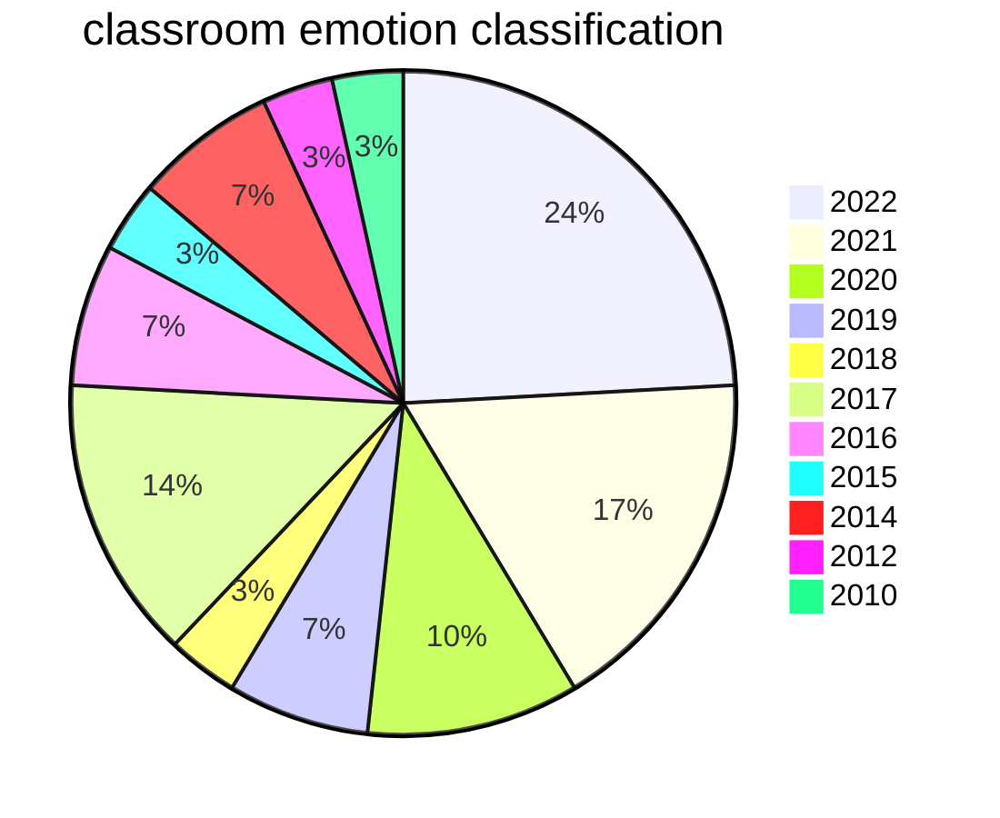
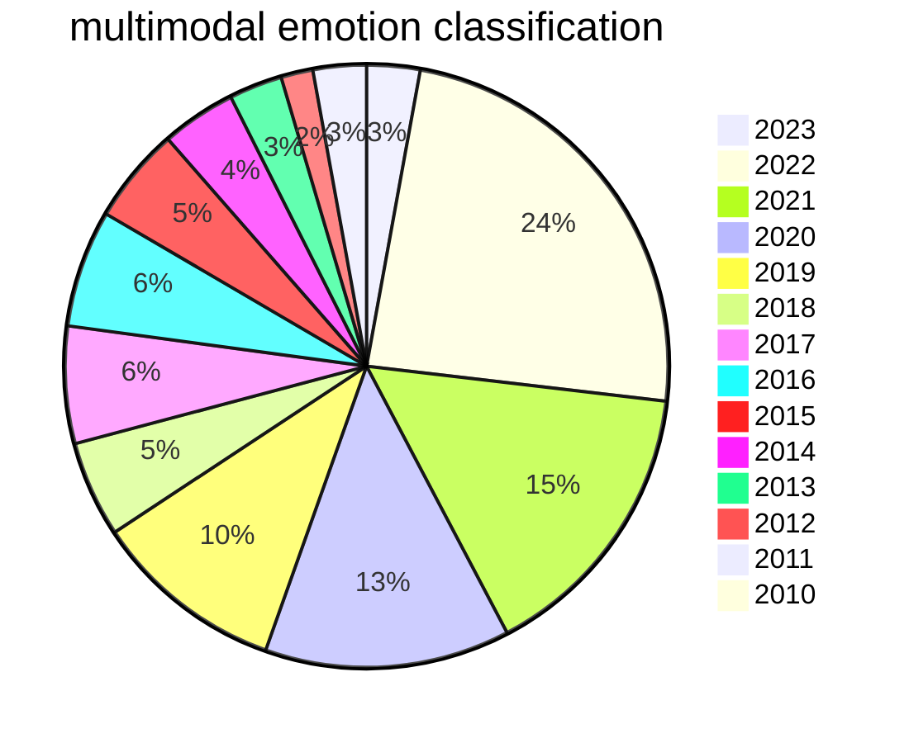

# wanb-course-mlops

The code related to the 3-week Weights & Biases' [MLOps course](https://www.wandb.courses/courses/effective-mlops-model-development).

Here, you can find a complete overview of the work done in the course. At the bottom, I will discuss the final project.

| week | assignment      | Colab | report | description |
| :---: |:-------------------: | :-----------: | :-------:| ------|
| 1| FER2013: Dataset and Baseline      |        || A notebook that functions as a baseline to build the pipeline integrating Weights & Biases with the [Lightning](https://www.pytorchlightning.ai/) ecosystem|
| 2 |
| 3 |

# Memory-constrained Visual Emotion Classification

## Problem statement

The task of emotion recognition is among the most complex ones in computer vision, as emotions are highly subjective and can be expressed in many different ways, such as through facial expressions, body language, and vocal cues. Recognizing emotions from face images is particularly challenging due to the variations in individual faces, lighting conditions, and expressions. These variations can make it difficult for traditional computer vision techniques to accurately classify emotions.

However, this technology has enormous potential, especially in fields such as mental health and wellness, customer experience, and human-computer interaction. Recognizing emotions from face images can help to track and analyze emotional changes in individuals, improve customer satisfaction, and make AI systems more responsive to human emotions. One of the newer fields where such technology may have a significant impact is education. Ever since the COVID-19 pandemic broke out, many different alteratives to the traditional schooling system have been developed and adopted, to facilitate the integration and engagement of students. In particular, teenagers all around the world have jumped from physical classes, to remote classes, back to physical classes, then to flipped classes, and more. The latter has seen a booming adoption due to its nature of reverting the roles during classes, and bringing the students to the classes, rather than the classes to the students. Nowadays, teenagers have grown accustomed with touch devices ever since their childood -- hence the term _touch-screen generation_^1 coined back in 2013 --, while their span of attention is at a generational low^2 in a constant hunt for interactivity and short bursts of dopamine (say hi TikTok^3). In this setting, the idea of flipped classrooms fits in pretty well, but not all adolescentes respond in the same manner. Therefore, being able to monitor how they respond inwhile in-session is a fundamental step towards teaching aid tools^4 that could help teacheers take proactive measures to maintain their focus and involvment following different nt modalities, with different strategies and  with different pacing.

In our proposed project, we aim to address the challenges of visual emotion recognition by developing a memory-efficient machine learning model for emotion classification from FER2013, a famous dataset of face images. This model will be designed with quantization techniques to allow it to run on low-end devices, making it accessible to a wider range of users and applications, especially in medical settings where memory constraints can be a significant barrier to adoption. If time will permit, we will evaluate our model on a downstream dataset of classroom settings trying to highloght how students respond over the course of a lecture. The efficiency of the model combined with its accuracy, could enable on-premises applications to monitor the emotional state of students during lectures.

## Business value analysis

1. Improved Learning Outcomes: By monitoring students' emotional states, teachers can identify students who may be struggling and provide targeted support to help them stay engaged and focused. This could result in improved learning outcomes and higher test scores, potentially leading to higher graduation rates.

2. Enhanced Student Engagement: By using real-time feedback from the model, teachers can adapt their teaching methods and adjust the pace and style of the class to better suit the emotional state of the students. This could lead to increased student engagement, higher attendance rates, and better student-teacher relationships.

3. Increased Productivity: Teachers can save time and increase productivity by using the model's real-time feedback to quickly identify and address issues before they escalate. This could result in fewer disruptions and a more positive learning environment.

4. Financial Benefits: By improving student outcomes and engagement, schools can expect to see increased enrollment and higher retention rates, leading to increased revenue. Additionally, schools can potentially license the technology to other educational institutions, generating additional revenue streams.

Let's make some sensible assumption on education costs:

A school with an annual enrollment of 500 students and a tuition fee of $10,000 per student could expect to see an increase of at least 5% in enrollment, resulting in an additional revenue of $500,000 per year.

If the technology is licensed to 10 other schools at $50,000 per license, the project could generate $500,000 in new revenue.

By improving student outcomes and engagement, a school with an average graduation rate of 75% could see a 2% increase, resulting in an additional 10 graduates per year.

In conclusion, our proposed emotion recognition technology could bring significant value to the education sector by improving student outcomes, enhancing student engagement, increasing productivity, and generating financial benefits. Investing in this project could help schools stay ahead of the competition and provide a more positive and effective learning environment for their students.

[1] https://www.theatlantic.com/magazine/archive/2013/04/the-touch-screen-generation/309250/  
[2] https://pubmed.ncbi.nlm.nih.gov/34444569/  
[3] https://www.sciencetimes.com/articles/36984/20220414/tiktok-brain-explained-endless-dopamine-rush-short-videos-kids-hooked.htm  
[4] https://pubmed.ncbi.nlm.nih.gov/35978909/  

## Timeline

https://pubmed.ncbi.nlm.nih.gov/?term=classroom+emotion+classification&filter=simsearch3.fft&filter=years.2010-2023

https://pubmed.ncbi.nlm.nih.gov/?term=multimodal+emotion+classification&filter=simsearch3.fft&filter=years.2010-2023

## Extra resources

https://pubmed.ncbi.nlm.nih.gov/34300666/  
https://pubmed.ncbi.nlm.nih.gov/24269801/  
https://pubmed.ncbi.nlm.nih.gov/35069919/  
https://pubmed.ncbi.nlm.nih.gov/35911019/  
https://github.com/kayvane1/wandb-course  
https://github.com/ali-ism/Wandb-Course  
https://github.com/aditya2kahol/wandb-model-dev-course  
https://github.com/wandb/edu/tree/main/lightning/projects  
https://github.com/wandb/edu/blob/main/lightning/projects/constrained_emotion_classifier.ipynb  
https://www.kaggle.com/datasets/msambare/fer2013
